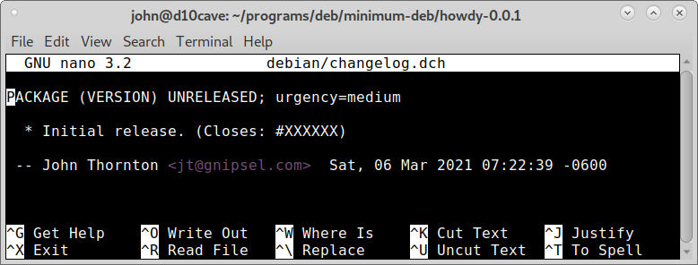
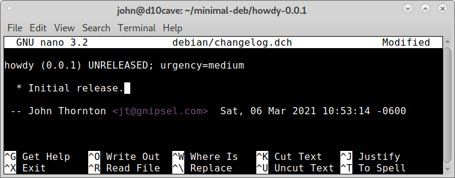

Creating Debian Files
=====================

The following files are needed in the `debian` directory.
::

	john@d10cave:~/minimal-deb$ tree
	.
	└── howdy-0.0.1
	    ├── debian
	    │   ├── compat
	    │   ├── control
	    │   ├── copyright
	    │   ├── files
	    │   ├── manpages
	    │   ├── rules
	    │   └── source
	    │       └── format
	    ├── man
	    └── src

	5 directories, 7 files

You can add them with the file manager or with the following commands.
::

	cd howdy-0.0.1/debian
	touch control compat copyright files manpages rules source/format
	cd ..

changelog
---------

Various Debian maintenance tools recognize your email address and name
to use by the shell environment variables $DEBEMAIL and $DEBFULLNAME.

You can add to the ~/.bashrc file with your favorite text editor. The ~
means your home directory.
::

	DEBEMAIL="your.email.address@example.org"
	DEBFULLNAME="Firstname Lastname"
	export DEBEMAIL DEBFULLNAME

Or in a terminal.
::

	cat >>~/.bashrc <<EOF
	DEBEMAIL="email.address@example.org"
	DEBFULLNAME="Firstname Lastname"
	export DEBEMAIL DEBFULLNAME
	EOF

The terminal should be in the howdy-0.0.1 directory to create the
changelog file with the following command.
::

	dch --create

Change the changelog file to match the following.

To save the changes press `ctrl x` then `y` then `enter`.

compat
------

The compat file simply contains `11`

control
-------

The control file has the following as a minimum to satisify lintian.
::

	Source: howdy  
	Maintainer: John Thornton <jt@gnipsel.com>
	Build-Depends: debhelper (>= 8.0.0)
	Standards-Version: 3.9.3
	Section: utils
	Priority: optional

	Package: howdy  
	Priority: optional  
	Architecture: any
	Depends: python3 (>=3.6), ${misc:Depends}  
	Description: simple helloworld package
	 Just prints "Hi", it's very useful.
	 Note the second and additional lines are
	 indented with one space.

copyright
---------

The copyright file just needs one line to make lintian happy.
::

	Copyright 2021, CnC Machines LLC

install
-------

The install file just needs one line to show where to install the
program.
::

	src/* usr/bin

manpages
--------

The manpages file contains the location of the man file.
::

	man/howdy.1

rules
-----

The rules file contains the following as a minimum. Make sure that is a
tab in front of `dh $@` and not a space.
::

	#!/usr/bin/make -f  
	%:  
		dh $@

format
------

The source/format file just needs one line.
::

	3.0 (native)

