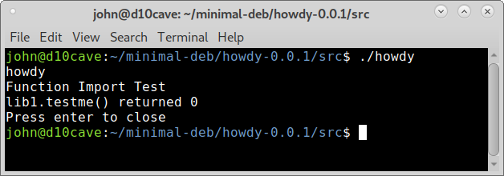
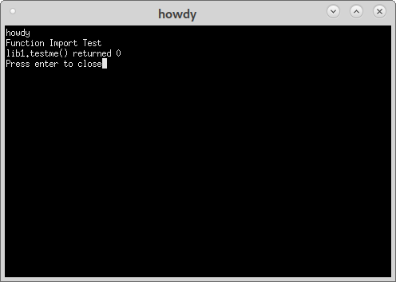

Importing Library
=================

Add the subdirectory `libhowdy` to howdy for our library file. Add an
`__init__.py` and `lib1.py` files to the libhowdy directory.
::

	john@d10cave:~/github/simple-deb/example$ tree
  .
	└── minimal-deb
	    └── howdy-0.0.1
	        ├── debian
	        │   ├── changelog
	        │   ├── compat
	        │   ├── control
	        │   ├── copyright
	        │   ├── install
	        │   ├── manpages
	        │   ├── rules
	        │   └── source
	        │       └── format
	        ├── Howdy.desktop
	        ├── man
	        │   └── howdy.1
	        └── src
	            ├── howdy
	            ├── __init__.py
	            └── libhowdy
	                ├── __init__.py
	                └── lib1.py

	7 directories, 14 files

lib1.py
-------
::

	def testme():
		print('Function Import Test')
		return 0

howdy
-----
::

	#!/usr/bin/env python3

	from libhowdy import lib1

	def main():
		print('howdy')
		ret = lib1.testme()
		print(f'lib1.testme() returned {ret}')

		input("Press enter to close")

	if __name__ == '__main__':
		main()

install
-------
::

	src/howdy usr/bin
	src/libhowdy/lib1.py usr/lib/python3/dist-packages/libhowdy
	*.desktop usr/share/applications

Open a terminal in the `howdy-0.0.1/src` directory and test the program.
The `./` means look in this directory for the executable file in linux.

Build the deb
-------------

As before open a terminal in the `howdy-0.0.1` directory and use
::

	dpkg-buildpackage -us -uc

In the `minimal-deb` directory right click on the deb and open with Gdebi
and install.

Run from the Applications > Accessories menu or from a terminal with the
command `howdy`.

